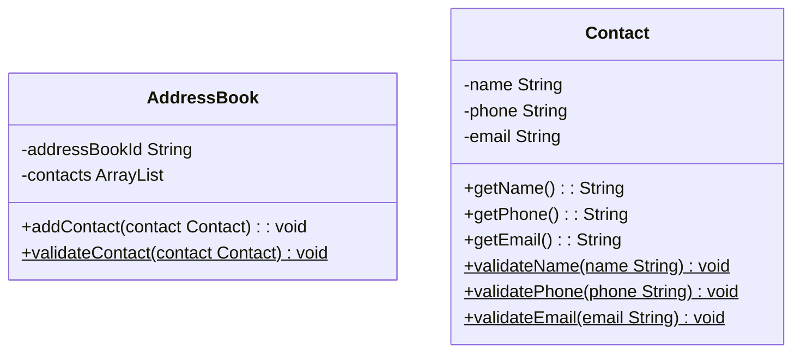

# Domain Models, Class Diagrams and Test Plan

## Requirements

The user should be able to add a contact to the address book
A contact should have at least a name, phone number and email address
The user should be able to search for a contact by name and have the results displayed
The user should be able to remove a contact from the address book
The user should be able to edit a contact's details
Duplicate phone numbers or email addresses should not be allowed, i.e. no two contacts should have the same phone number or email address
The user should be able to view all contacts in the address book
The user should be using a console interface to interact with the application

## User Stories

1. As a user, I want to access my address book, so I can add and view contacts.
   - AddressBook getId should return correct ID ✓
2. As a user, I want to be able to create a contact with a name, phone and email, so I can add it to the address book.
   - getName, getPhone and getEmail should return correct name, phone and email ✓
3. As a user, I want to be able to create a contact if I give valid values, so that there are no errors.
   - Contact constructor throws IllegalArgumentException when name is null ✓
   - Contact constructor throws IllegalArgumentException when name is empty ✓
   - Contact constructor throws IllegalArgumentException when name is whitespace ✓
   - Contact constructor throws IllegalArgumentException when name is not of valid pattern ✓
   - Contact constructor throws IllegalArgumentException when phone is null ✓
   - Contact constructor throws IllegalArgumentException when phone is empty ✓
   - Contact constructor throws IllegalArgumentException when phone is whitespace ✓
   - Contact constructor throws IllegalArgumentException when phone is not of valid pattern ✓
   - Contact constructor throws IllegalArgumentException when email is null ✓
   - Contact constructor throws IllegalArgumentException when email is empty ✓
   - Contact constructor throws IllegalArgumentException when email is whitespace ✓
   - Contact constructor throws IllegalArgumentException when email is not of valid pattern ✓
4. As a user, I want to be able to add a contact to my address book, so I can keep their details. 
   - addContact adds contact when valid contact is passed in ✓
   - addContact throws IllegalArgumentException when contact is null ✓
5. As a user, I want to be able to have a contact displayed, so I can view their details.
   - AddressBookHelper printContact prints a contact ✓
   - AddressBook displayContact prints a contact ✓
   - displayContact throws IllegalArgumentException when contact is null ✓
6. As a user, I want to be able to search for a contact by name, so I can find a particular contact.
   - Searching for a name that exists returns that contact ✓
   - Searching for a name that doesn't exist throws a UserNotFoundException ✓
   - SearchContact throws IllegalArgumentException when input is null ✓
   - SearchContact throws IllegalArgumentException when input is empty ✓
7. As a user, I want to be able to search for a contact by name and have the results displayed, so I can view a contact.
8. As a user, I want to be able to remove a contact, so I can...
9. As a user, I want to be able to edit a contact's details, so I can update any changes. 
10. As an address book, I do not want to allow duplicate phone numbers or emails, so that errors do not occur.
11. As a user, I want to be able to view all contacts in the address book
12. As a user, I want to be able to interact with my address book using a console interface. 

## Class Diagrams

