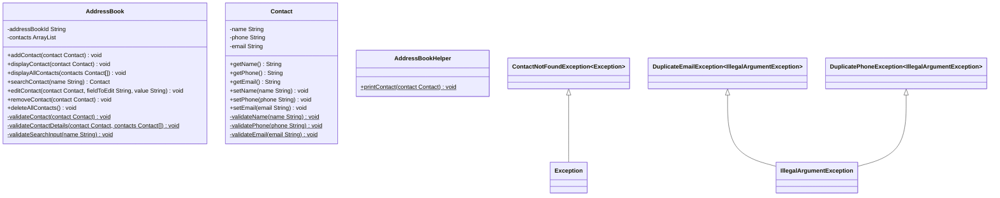

# Domain Models, Class Diagrams and Test Plan

## User Stories and Test Plan

1. **As a user, I want to access my address book, so I can add and view contacts.**
   - AddressBook getId should return correct ID ✓
2. **As a user, I want to be able to create a contact with a name, phone and email, so I can add it to the address book.**
   - getName, getPhone and getEmail should return correct name, phone and email ✓
3. **As a user, I want to be able to create a contact if I give valid values, so that there are no errors.**
   - Contact constructor throws IllegalArgumentException when name is null ✓
   - Contact constructor throws IllegalArgumentException when name is empty ✓
   - Contact constructor throws IllegalArgumentException when name is whitespace ✓
   - Contact constructor throws IllegalArgumentException when name is not of valid pattern ✓
   - Contact constructor throws IllegalArgumentException when phone is null ✓
   - Contact constructor throws IllegalArgumentException when phone is empty ✓
   - Contact constructor throws IllegalArgumentException when phone is whitespace ✓
   - Contact constructor throws IllegalArgumentException when phone is not of valid pattern ✓
   - Contact constructor throws IllegalArgumentException when email is null ✓
   - Contact constructor throws IllegalArgumentException when email is empty ✓
   - Contact constructor throws IllegalArgumentException when email is whitespace ✓
   - Contact constructor throws IllegalArgumentException when email is not of valid pattern ✓
4. **As a user, I want to be able to add a contact to my address book, so I can keep their details.**
   - addContact adds contact when valid contact is passed in ✓
   - addContact throws IllegalArgumentException when contact is null ✓
5. **As a user, I want to be able to have a contact displayed, so I can view their details.**
   - AddressBookHelper printContact prints a contact ✓
   - AddressBook displayContact prints a contact ✓
   - displayContact throws IllegalArgumentException when contact is null ✓
6. **As a user, I want to be able to search for a contact by name, so I can find a particular contact.**
   - Searching for a name that exists returns that contact ✓
   - Searching for a name that doesn't exist throws a UserNotFoundException ✓
   - searchContact throws IllegalArgumentException when input is null ✓
   - searchContact throws IllegalArgumentException when input is empty ✓
7. **As a user, I want to be able to remove a contact, so I can keep contact information up to date.**
   - removeContact removes contact from the AddressBook ✓
   - removeContact throws IllegalArgumentException when contact is null ✓
8. **As a user, I want to be able to edit a contact's details, so I can update any changes.** 
   - Contact setName throws IllegalArgumentException when name is null ✓
   - Contact setName throws IllegalArgumentException when name is empty ✓
   - Contact setName throws IllegalArgumentException when name is not of valid pattern ✓
   - Contact setPhone throws IllegalArgumentException when phone is null ✓
   - Contact setPhone throws IllegalArgumentException when phone is empty ✓
   - Contact setPhone throws IllegalArgumentException when phone is not of valid pattern ✓
   - Contact setEmail throws IllegalArgumentException when email is null ✓
   - Contact setEmail throws IllegalArgumentException when email is empty ✓
   - Contact setEmail throws IllegalArgumentException when email is not of valid pattern ✓
   - EditContact name calls Contact.setName ✓
   - EditContact phone calls Contact.setPhone ✓
   - EditContact email calls Contact.setEmail ✓
9. **As an address book, I do not want to allow duplicate phone numbers or emails, so that errors do not occur.**
   - AddContact throws DuplicatePhoneException when phone already exists ✓
   - AddContact throws DuplicateEmailException when email already exists ✓
10. **As a user, I want to be able to view all contacts in the address book.**
    - AddressBook displayAllContact prints expected values ✓
    - AddressBook displayAllContact prints message if no contacts ✓
11. **As a user, I want to be able to interact with my address book using a console interface.**
12. **As a user, I want to be able to search for a contact by name and have the results displayed, so I can view a contact.**

#### Additional Features: User Stories and Test Plan (Gen AI used)

13. **As a user, I want to be able to delete all contacts at once so that I can easily clear the address book when needed.**
    - AddressBook deleteAllContacts deletes all contacts from addressBook ✓
    - DeleteAllContacts works when contacts array is empty ✓
14. **As a user, I want to be asked to confirm my choice before deleting all contacts, so that I don't unintentionally delete them all.** 

## Class Diagrams

