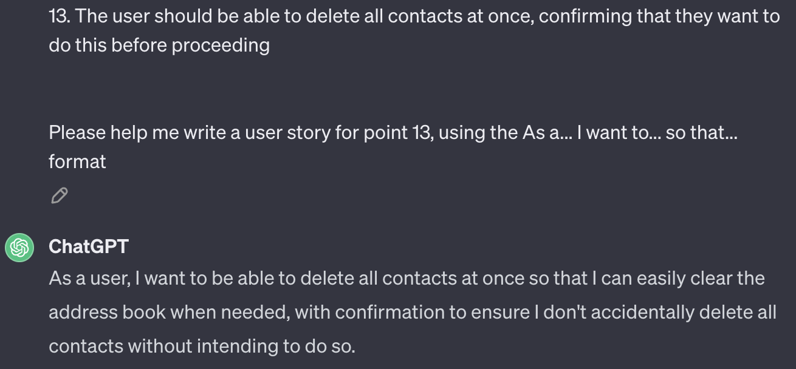
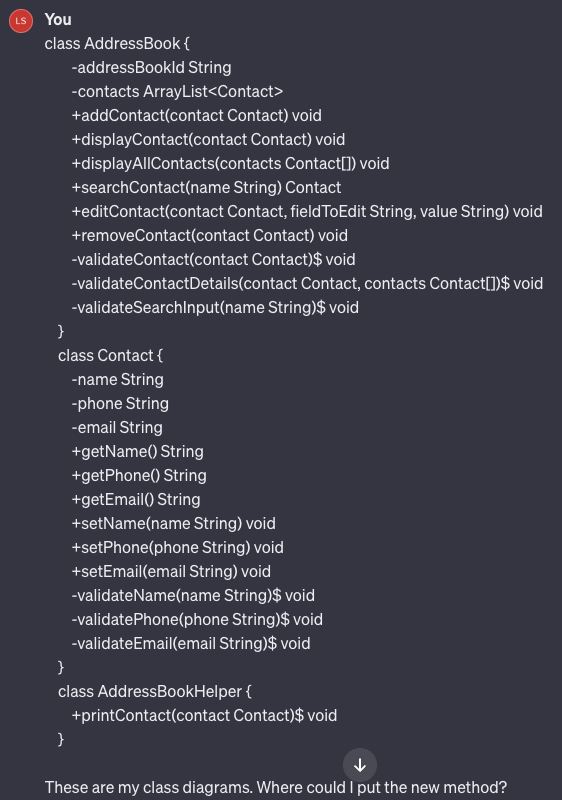
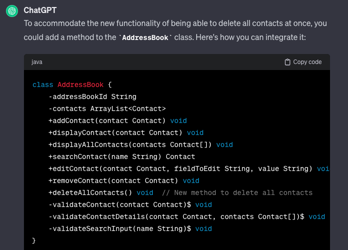
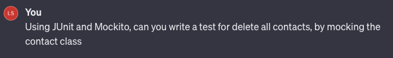
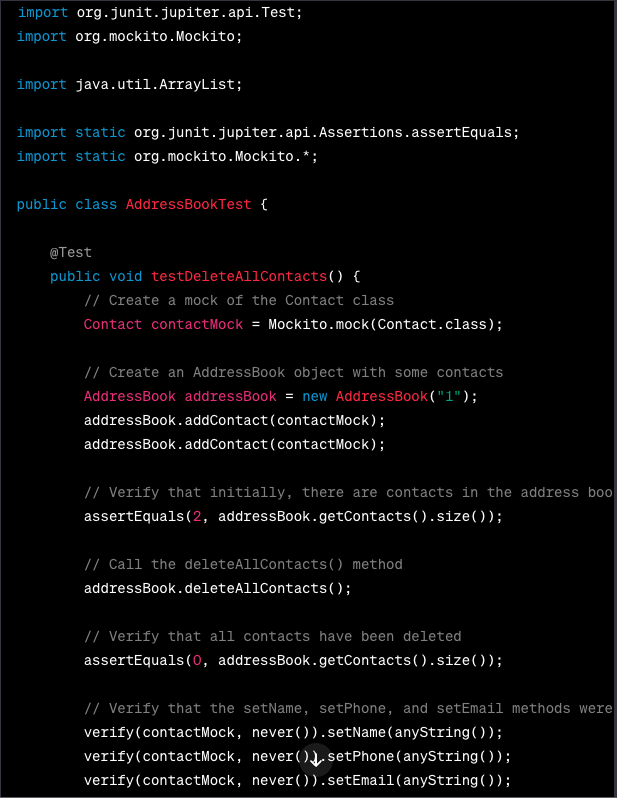
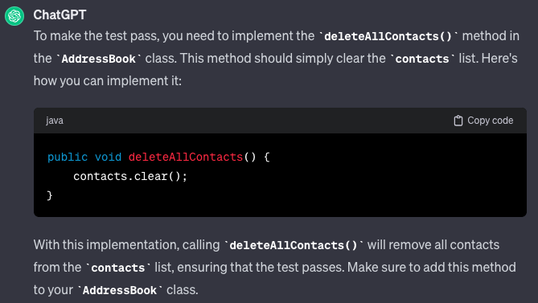
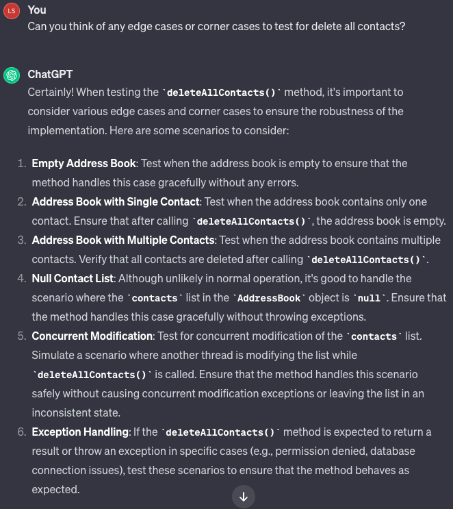
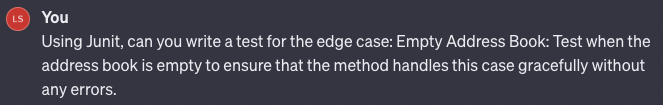
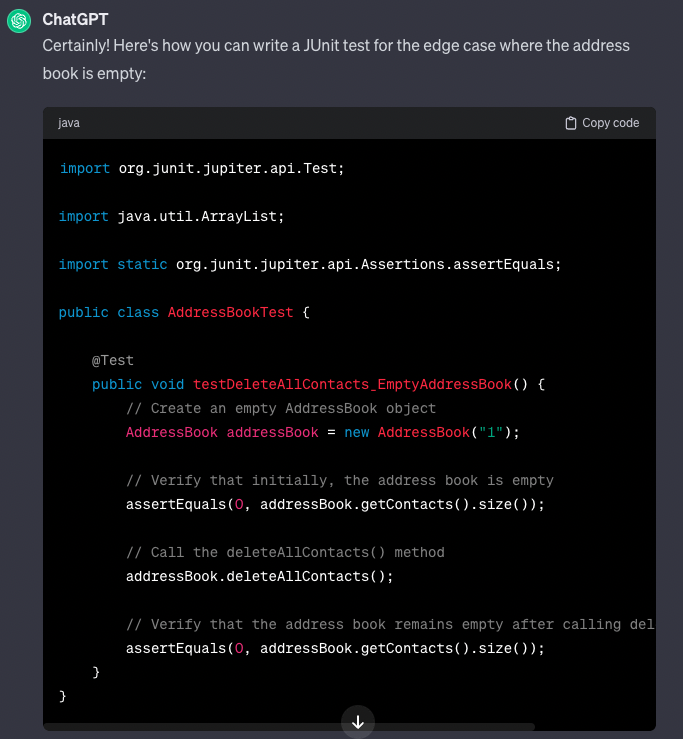

# Use of Generative AI for Additional Features 

1. To help generate user stories and class diagrams. 

2. To help write a test for the user story

3. To help write code to pass the test 

4. To help generate edge and corner cases

5. To help write code to pass the edge case 

